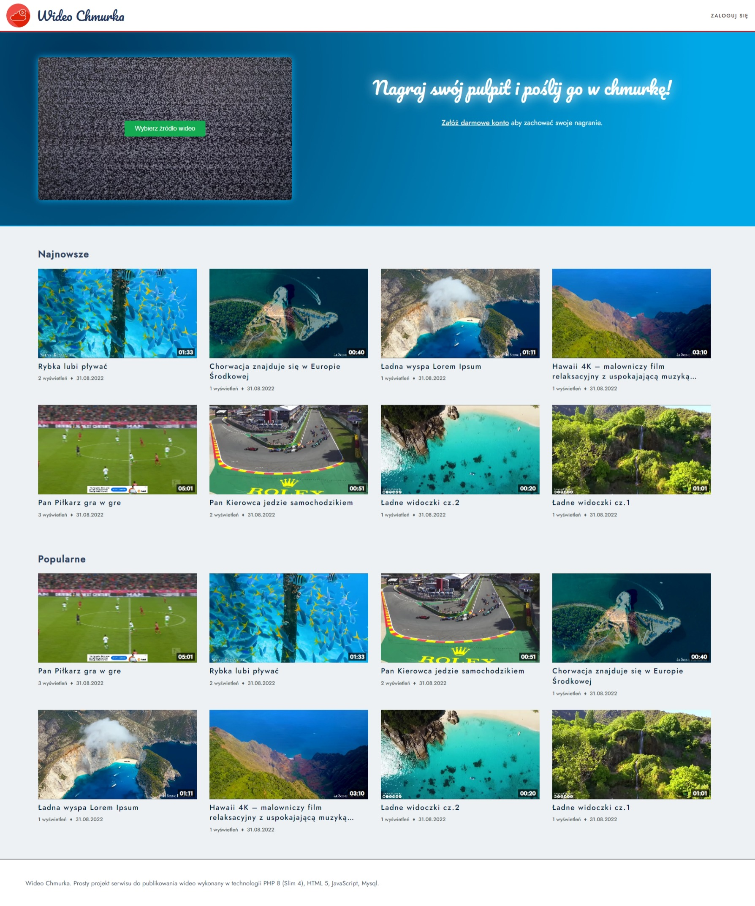

# Wideo Chmurka
Projekt prostego serwisu do nagrywania pulpitu i publikowania wideo wykonany w technologii Laravel 9 (PHP 8.1), HTML 5, JavaScript, MongoDB.

## Szybki start

Uruchomienie projektu wymaga zainstalowania:
* docker
* plugin docker compose
* git
* git lfs


```bash
$ git clone git@github.com:dmcode/wideo_chmurka.git
$ cd wideo_chmurka
$ cp .env.example .env
$ docker compose build
$ docker compose up main_db -d
$ docker compose run --rm main_php php artisan migrate
$ docker compose up
```

Aplikacja będzie dostępna pod adresem: http://localhost:8000


## Wymagania w przypadku ręcznej konfiguracji środowiska

 * MongoDB 5 (niższe wersje nie testowane)
 * PHP 8.1 (niższe wersje nie testowane)
 * Włączone moduły PHP: mongodb
 * Zainstalowany ffmpeg


## Screenshots


